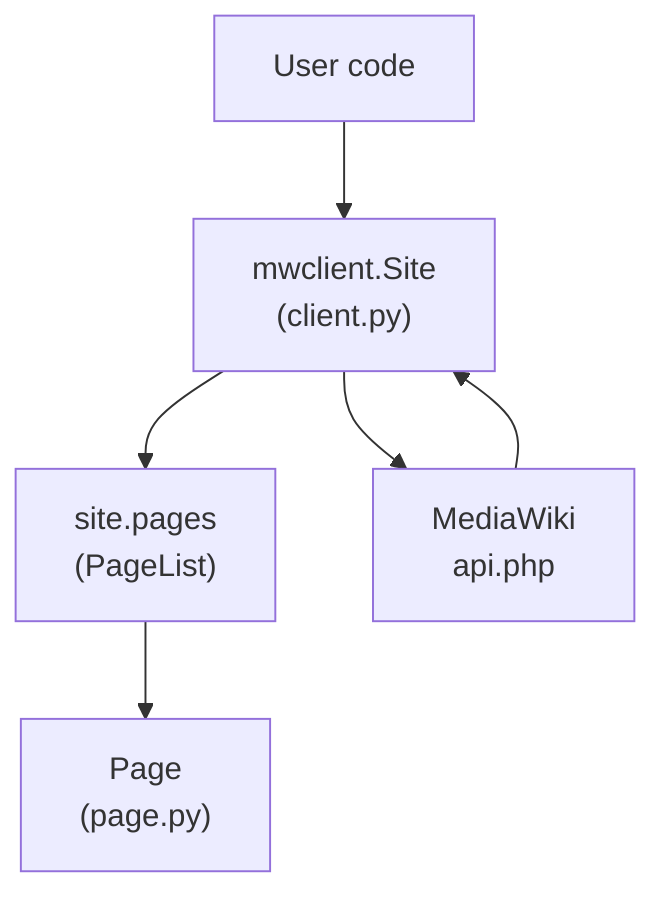
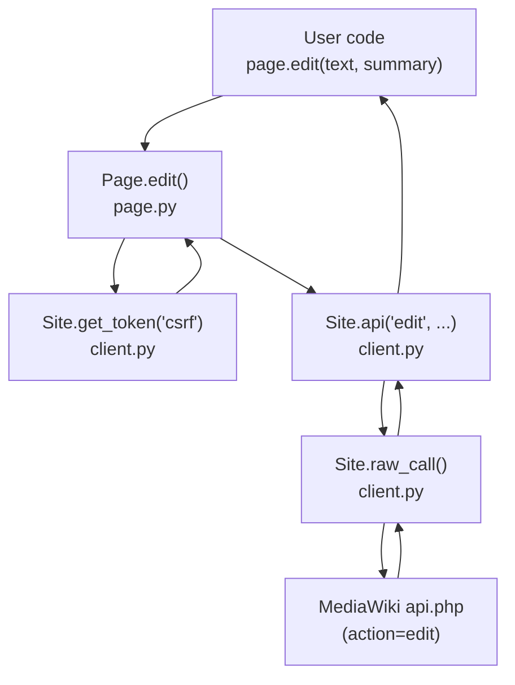
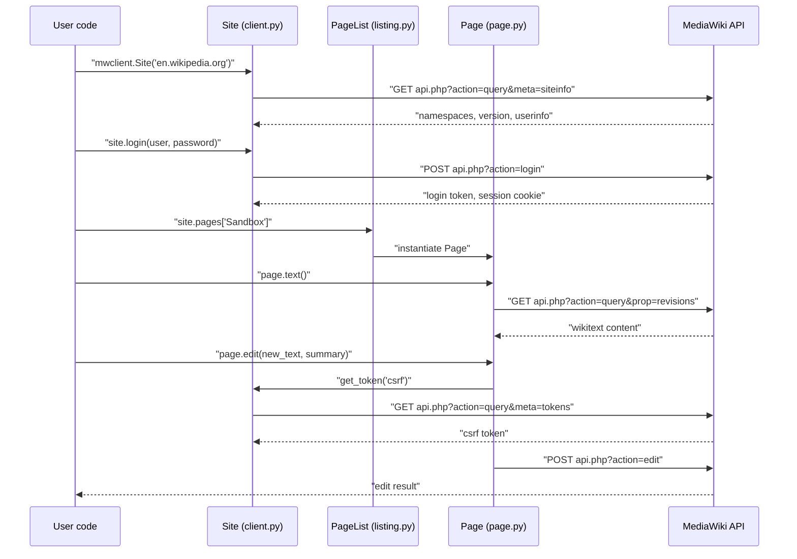

# Installation and Quick Start

> **Relevant source files**
>
> -   [README.md](https://github.com/mwclient/mwclient/blob/47ea5b29/README.md?plain=1)
> -   [docs/source/conf.py](https://github.com/mwclient/mwclient/blob/47ea5b29/docs/source/conf.py)
> -   [docs/source/index.rst](https://github.com/mwclient/mwclient/blob/47ea5b29/docs/source/index.rst)
> -   [docs/source/user/connecting.rst](https://github.com/mwclient/mwclient/blob/47ea5b29/docs/source/user/connecting.rst)
> -   [docs/source/user/page-ops.rst](https://github.com/mwclient/mwclient/blob/47ea5b29/docs/source/user/page-ops.rst)
> -   [examples/basic_edit.py](https://github.com/mwclient/mwclient/blob/47ea5b29/examples/basic_edit.py)
> -   [examples/upload.py](https://github.com/mwclient/mwclient/blob/47ea5b29/examples/upload.py)
> -   [pyproject.toml](https://github.com/mwclient/mwclient/blob/47ea5b29/pyproject.toml)

This page covers installing mwclient and performing the three most common initial tasks: connecting to a wiki, reading a page, and making an edit. It is the recommended starting point for new users.

For a full description of connection options (proxies, SSL certificates, custom headers), see [Connecting to a Site](/mwclient/mwclient/2.1-connecting-to-a-site). For all authentication methods (OAuth, clientlogin, bot passwords), see [Authentication](/mwclient/mwclient/2.2-authentication). For an overview of what each module in the package contains, see [Package Structure](/mwclient/mwclient/1.2-package-structure).

---

## Installing mwclient

mwclient is distributed as a standard Python package. It requires **Python 3.7 or above** and has two runtime dependencies: `requests` and `requests-oauthlib` ([pyproject.toml L27-L30](https://github.com/mwclient/mwclient/blob/47ea5b29/pyproject.toml#L27-L30)

).

### Stable release (recommended)

Install from PyPI:

```
pip install mwclient
```

This installs the current stable release (0.11.0 at time of writing).

### Development version

Install directly from the GitHub repository HEAD:

```
pip install git+git://github.com/mwclient/mwclient.git
```

### Optional extras

| Extra               | Purpose                            | Packages installed                  |
| ------------------- | ---------------------------------- | ----------------------------------- |
| `mwclient[docs]`    | Build Sphinx documentation locally | `sphinx`, `sphinx-rtd-theme`        |
| `mwclient[testing]` | Run the test suite                 | `pytest`, `pytest-cov`, `responses` |

The extras are declared in [pyproject.toml L32-L43](https://github.com/mwclient/mwclient/blob/47ea5b29/pyproject.toml#L32-L43)

### Editable install (for contributors)

```
pip install -e .
```

Run from a clone of the repository. For contributor workflow details, see [Development Guide](/mwclient/mwclient/7-development-guide).

---

## What gets installed

The `mwclient` namespace exposes two things directly after install:

-   `mwclient.Site` — the primary entry point class
-   `mwclient.errors.*` — all exception classes

These are re-exported from [mwclient/**init**.py](https://github.com/mwclient/mwclient/blob/47ea5b29/mwclient/__init__.py)

---

## First connection

**Diagram: Objects involved in a first connection**



Sources: [mwclient/**init**.py](https://github.com/mwclient/mwclient/blob/47ea5b29/mwclient/__init__.py)

[mwclient/client.py](https://github.com/mwclient/mwclient/blob/47ea5b29/mwclient/client.py)

[docs/source/user/connecting.rst L1-L20](https://github.com/mwclient/mwclient/blob/47ea5b29/docs/source/user/connecting.rst#L1-L20)

---

Connect to a wiki by constructing a `Site` object with the hostname of the target wiki. Do **not** include the protocol or API path in the hostname.

```javascript
import mwclient user_agent = 'MyCoolTool/0.2 (xyz@example.org)'site = mwclient.Site('en.wikipedia.org', clients_useragent=user_agent)
```

The `clients_useragent` parameter is optional but strongly recommended. Wikimedia wikis may reject or rate-limit requests without a recognizable user agent. mwclient appends its own identifier to the string you supply ([docs/source/user/connecting.rst L63-L67](https://github.com/mwclient/mwclient/blob/47ea5b29/docs/source/user/connecting.rst#L63-L67)

).

### Common constructor parameters

| Parameter           | Type       | Default      | Purpose                             |
| ------------------- | ---------- | ------------ | ----------------------------------- |
| `host`              | `str`      | _(required)_ | Hostname, e.g. `'en.wikipedia.org'` |
| `path`              | `str`      | `'/w/'`      | Script path on the server           |
| `scheme`            | `str`      | `'https'`    | `'http'` or `'https'`               |
| `clients_useragent` | `str`      | `None`       | Your tool's user-agent string       |
| `consumer_token`    | `str`      | `None`       | OAuth 1 consumer token              |
| `httpauth`          | `AuthBase` | `None`       | HTTP Basic/Digest auth object       |

If your wiki uses a non-standard script path (not `/w/`), specify it:

```
site = mwclient.Site('my-wiki.example.org', path='/wiki/')
```

A `404 Not Found` or `mwclient.errors.InvalidResponse` on connect usually means the `path` is wrong ([docs/source/user/connecting.rst L36-L43](https://github.com/mwclient/mwclient/blob/47ea5b29/docs/source/user/connecting.rst#L36-L43)

).

---

## Reading a page

Pages are accessed through the `site.pages` attribute, which is a `PageList` instance. Indexing it by title returns a `Page` object.

```python
page = site.pages['Leipäjuusto'] # Read the wikitexttext = page.text() # Check whether the page existsif page.exists:    print(text)
```

`page.text()` returns an empty string for non-existent pages rather than raising an exception ([docs/source/user/page-ops.rst L26-L30](https://github.com/mwclient/mwclient/blob/47ea5b29/docs/source/user/page-ops.rst#L26-L30)

).

### Navigating related content

```python
# List categories the page belongs tofor category in page.categories():    print(category.name) # List pages that link herefor link in page.backlinks():    print(link.name)
```

---

## Making an edit

**Diagram: Edit flow through the call stack**



Sources: [mwclient/client.py](https://github.com/mwclient/mwclient/blob/47ea5b29/mwclient/client.py)

[mwclient/page.py](https://github.com/mwclient/mwclient/blob/47ea5b29/mwclient/page.py)

---

Editing requires authentication on most wikis. The simplest non-OAuth method uses `site.login()`:

```
site.login('MyUsername', 'MyBotPassword') page = site.pages['Sandbox']current_text = page.text() new_text = current_text + '\n== New section =='page.edit(new_text, 'Added a new section')
```

`Page.edit()` acquires a CSRF token automatically on first use and caches it for subsequent calls. If the page is protected or you lack permission, `mwclient.errors.ProtectedPageError` is raised.

For Wikimedia wikis the recommended approach is OAuth 1:

```
site = mwclient.Site(    'en.wikipedia.org',    consumer_token='my_consumer_token',    consumer_secret='my_consumer_secret',    access_token='my_access_token',    access_secret='my_access_secret',)
```

See [Authentication](/mwclient/mwclient/2.2-authentication) for the full coverage of all authentication methods.

---

## Flow: from import to first edit



Sources: [mwclient/client.py](https://github.com/mwclient/mwclient/blob/47ea5b29/mwclient/client.py)

[mwclient/page.py](https://github.com/mwclient/mwclient/blob/47ea5b29/mwclient/page.py)

[mwclient/listing.py](https://github.com/mwclient/mwclient/blob/47ea5b29/mwclient/listing.py)

[docs/source/user/connecting.rst](https://github.com/mwclient/mwclient/blob/47ea5b29/docs/source/user/connecting.rst)

[docs/source/user/page-ops.rst](https://github.com/mwclient/mwclient/blob/47ea5b29/docs/source/user/page-ops.rst)

---

## Common errors at startup

| Error                                 | Typical cause                                                                         |
| ------------------------------------- | ------------------------------------------------------------------------------------- |
| `mwclient.errors.InvalidResponse`     | Wrong `path`, site returned HTML instead of JSON                                      |
| `mwclient.errors.LoginError`          | Bad credentials, or editing without authentication while `site.force_login` is `True` |
| `mwclient.errors.APIError`            | MediaWiki returned an API-level error (check `.code` and `.info` attributes)          |
| `requests.exceptions.ConnectionError` | Hostname unreachable or incorrect `scheme`                                            |

All mwclient exceptions inherit from `mwclient.errors.MwClientError`. See [Error Handling](/mwclient/mwclient/6-error-handling) for the full exception hierarchy.
