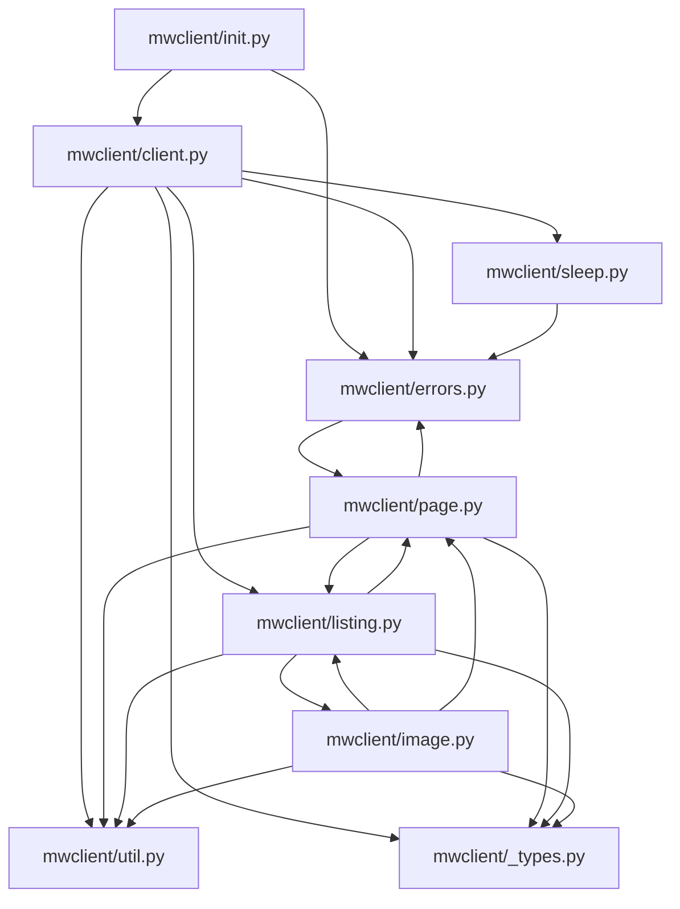
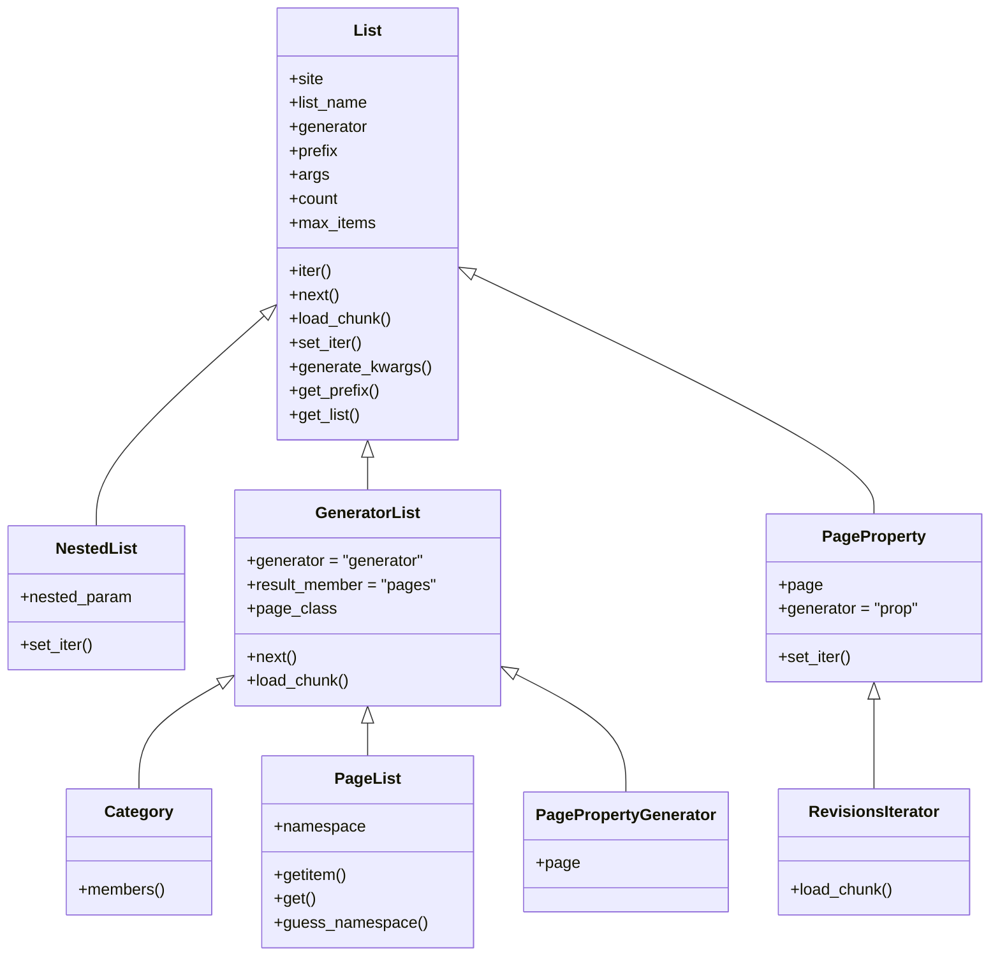
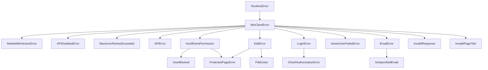

# Package Structure

> **Relevant source files**
> * [.gitignore](https://github.com/mwclient/mwclient/blob/47ea5b29/.gitignore)
> * [mwclient/__init__.py](https://github.com/mwclient/mwclient/blob/47ea5b29/mwclient/__init__.py)
> * [mwclient/client.py](https://github.com/mwclient/mwclient/blob/47ea5b29/mwclient/client.py)
> * [mwclient/errors.py](https://github.com/mwclient/mwclient/blob/47ea5b29/mwclient/errors.py)
> * [mwclient/image.py](https://github.com/mwclient/mwclient/blob/47ea5b29/mwclient/image.py)
> * [mwclient/listing.py](https://github.com/mwclient/mwclient/blob/47ea5b29/mwclient/listing.py)
> * [mwclient/page.py](https://github.com/mwclient/mwclient/blob/47ea5b29/mwclient/page.py)
> * [mwclient/sleep.py](https://github.com/mwclient/mwclient/blob/47ea5b29/mwclient/sleep.py)
> * [mwclient/util.py](https://github.com/mwclient/mwclient/blob/47ea5b29/mwclient/util.py)

This page describes the physical layout of the `mwclient` Python package, what each module is responsible for, how the modules import from one another, and what symbols are exposed at the top-level `mwclient` namespace. It is a structural reference, not an API reference.

For details on how to use the `Site` class, see [The Site Class](/mwclient/mwclient/2-the-site-class). For pagination and iteration internals, see [Iteration and Pagination](/mwclient/mwclient/5-iteration-and-pagination). For the full exception hierarchy, see [Error Handling](/mwclient/mwclient/6-error-handling).

---

## Module Overview

The package lives entirely inside the `mwclient/` directory. There are no sub-packages.

| File | Primary exports | Role |
| --- | --- | --- |
| `mwclient/__init__.py` | `Site`, `__version__`, `errors.*` | Package entry point; re-exports public symbols |
| `mwclient/client.py` | `Site` | Connection, authentication, raw API calls |
| `mwclient/page.py` | `Page` | Page reading, editing, and page-scoped listings |
| `mwclient/listing.py` | `List`, `GeneratorList`, `NestedList`, `Category`, `PageList`, `PageProperty`, `PagePropertyGenerator`, `RevisionsIterator` | Lazy-pagination iterators |
| `mwclient/image.py` | `Image` | File/image metadata, download, upload utilities |
| `mwclient/errors.py` | `MwClientError` and all subclasses | Exception hierarchy |
| `mwclient/sleep.py` | `Sleepers`, `Sleeper` | Retry back-off logic |
| `mwclient/util.py` | `parse_timestamp`, `read_in_chunks`, `handle_limit` | Shared utility functions |
| `mwclient/_types.py` | `Cookies`, `Namespace`, `VersionTuple` | Type aliases used across modules |

Sources: [mwclient/__init__.py L1-L34](https://github.com/mwclient/mwclient/blob/47ea5b29/mwclient/__init__.py#L1-L34)

 [mwclient/client.py L1-L20](https://github.com/mwclient/mwclient/blob/47ea5b29/mwclient/client.py#L1-L20)

 [mwclient/page.py L1-L10](https://github.com/mwclient/mwclient/blob/47ea5b29/mwclient/page.py#L1-L10)

 [mwclient/listing.py L1-L10](https://github.com/mwclient/mwclient/blob/47ea5b29/mwclient/listing.py#L1-L10)

 [mwclient/image.py L1-L10](https://github.com/mwclient/mwclient/blob/47ea5b29/mwclient/image.py#L1-L10)

 [mwclient/errors.py L1-L10](https://github.com/mwclient/mwclient/blob/47ea5b29/mwclient/errors.py#L1-L10)

 [mwclient/sleep.py L1-L10](https://github.com/mwclient/mwclient/blob/47ea5b29/mwclient/sleep.py#L1-L10)

 [mwclient/util.py L1-L10](https://github.com/mwclient/mwclient/blob/47ea5b29/mwclient/util.py#L1-L10)

---

## Inter-Module Import Graph

The diagram below maps every import relationship between source files. Arrows indicate "imports from".

**Module Dependency Map**



Sources: [mwclient/__init__.py L26-L27](https://github.com/mwclient/mwclient/blob/47ea5b29/mwclient/__init__.py#L26-L27)

 [mwclient/client.py L12-L16](https://github.com/mwclient/mwclient/blob/47ea5b29/mwclient/client.py#L12-L16)

 [mwclient/page.py L6-L9](https://github.com/mwclient/mwclient/blob/47ea5b29/mwclient/page.py#L6-L9)

 [mwclient/listing.py L5-L8](https://github.com/mwclient/mwclient/blob/47ea5b29/mwclient/listing.py#L5-L8)

 [mwclient/image.py L4-L7](https://github.com/mwclient/mwclient/blob/47ea5b29/mwclient/image.py#L4-L7)

 [mwclient/sleep.py L5](https://github.com/mwclient/mwclient/blob/47ea5b29/mwclient/sleep.py#L5-L5)

 [mwclient/errors.py L1-L4](https://github.com/mwclient/mwclient/blob/47ea5b29/mwclient/errors.py#L1-L4)

---

## Module Details

### mwclient/__init__.py

The sole purpose of this file is to define what is available when a user writes `import mwclient`.

```javascript
from mwclient.errors import *
from mwclient.client import Site as Site, __version__ as __version__
```

[mwclient/__init__.py L26-L34](https://github.com/mwclient/mwclient/blob/47ea5b29/mwclient/__init__.py#L26-L34)

* All exception classes from `errors.py` are star-imported and therefore available directly under the `mwclient` namespace (e.g. `mwclient.APIError`).
* `Site` is re-exported explicitly so it appears in type stubs and IDEs.
* `__version__` originates in `client.py` at [mwclient/client.py L18](https://github.com/mwclient/mwclient/blob/47ea5b29/mwclient/client.py#L18-L18)  and is re-exported here.
* A `NullHandler` is added to the `mwclient` logger so that library users are not forced to configure logging.
* `DeprecationWarning` is set to always show so that users see warnings about deprecated parameters.

Sources: [mwclient/__init__.py L1-L34](https://github.com/mwclient/mwclient/blob/47ea5b29/mwclient/__init__.py#L1-L34)

---

### mwclient/client.py

Contains the single class `Site` [mwclient/client.py L25](https://github.com/mwclient/mwclient/blob/47ea5b29/mwclient/client.py#L25-L25)

 which is the root object for all interactions with a MediaWiki instance. It is responsible for:

* Establishing and holding the `requests.Session` (`self.connection`)
* Exposing `get()`, `post()`, and `api()` as the primary call interface
* Exposing `raw_call()`, `raw_api()`, and `raw_index()` as the lower transport layer
* Managing authentication state (`self.logged_in`, `self.credentials`, `self.tokens`)
* Holding site metadata (`self.namespaces`, `self.version`, `self.groups`, `self.rights`)
* Constructing the three `PageList` instances at `self.pages`, `self.images`, and `self.categories` [mwclient/client.py L194-L196](https://github.com/mwclient/mwclient/blob/47ea5b29/mwclient/client.py#L194-L196)
* Hosting all site-level listing methods (e.g., `allpages`, `search`, `recentchanges`)

The module-level constant `USER_AGENT` [mwclient/client.py L22](https://github.com/mwclient/mwclient/blob/47ea5b29/mwclient/client.py#L22-L22)

 defines the default HTTP User-Agent string.

Sources: [mwclient/client.py L25-L219](https://github.com/mwclient/mwclient/blob/47ea5b29/mwclient/client.py#L25-L219)

---

### mwclient/page.py

Contains the `Page` class [mwclient/page.py L12](https://github.com/mwclient/mwclient/blob/47ea5b29/mwclient/page.py#L12-L12)

 which represents a single wiki page. It is instantiated by `PageList.get()` in `listing.py`, and also directly by user code.

Key responsibilities:

* Fetching and caching page metadata on construction (`name`, `namespace`, `exists`, `revision`, `protection`, etc.)
* `text()` — retrieves wikitext with optional section and template expansion
* `edit()`, `append()`, `prepend()`, `save()` — write operations
* `move()`, `delete()`, `purge()`, `touch()` — management operations
* Page-scoped listing methods: `revisions()`, `backlinks()`, `categories()`, `links()`, `templates()`, etc.

`Page` is the base class for both `Image` and `Category`.

Sources: [mwclient/page.py L12-L92](https://github.com/mwclient/mwclient/blob/47ea5b29/mwclient/page.py#L12-L92)

---

### mwclient/listing.py

Contains the full iterator class hierarchy used for all paginated API results.

**Class hierarchy in `listing.py`**



Each class that inherits `List` uses lazy pagination: it fetches one API chunk at a time and yields items one at a time. The `continue` token from the MediaWiki API drives successive chunk fetches.

`Category` inherits both `mwclient.page.Page` and `GeneratorList`, making it both a page object and an iterable of its members [mwclient/listing.py L216](https://github.com/mwclient/mwclient/blob/47ea5b29/mwclient/listing.py#L216-L216)

`PageList` is the type of `site.pages`, `site.images`, and `site.categories`. Its `get()` method [mwclient/listing.py L295-L332](https://github.com/mwclient/mwclient/blob/47ea5b29/mwclient/listing.py#L295-L332)

 dispatches to `Category`, `Image`, or `Page` based on namespace number.

Sources: [mwclient/listing.py L11-L404](https://github.com/mwclient/mwclient/blob/47ea5b29/mwclient/listing.py#L11-L404)

---

### mwclient/image.py

Contains the `Image` class [mwclient/image.py L10](https://github.com/mwclient/mwclient/blob/47ea5b29/mwclient/image.py#L10-L10)

 which extends `Page`. On construction it requests `imageinfo` as an extra property, populating `self.imageinfo` with metadata such as URL, size, SHA1, and MIME type.

Additional methods beyond `Page`:

* `imagehistory()` — returns a `PageProperty` of past file revisions
* `imageusage()` — returns a `List` of pages using this file
* `duplicatefiles()` — returns a `PageProperty` of duplicate file entries
* `download()` — fetches raw file bytes, optionally streaming into a file handle

Sources: [mwclient/image.py L10-L141](https://github.com/mwclient/mwclient/blob/47ea5b29/mwclient/image.py#L10-L141)

---

### mwclient/errors.py

Defines the complete exception hierarchy rooted at `MwClientError(RuntimeError)`.

**Exception hierarchy**



Notable design detail: `ProtectedPageError` inherits from **both** `EditError` and `InsufficientPermission` [mwclient/errors.py L58](https://github.com/mwclient/mwclient/blob/47ea5b29/mwclient/errors.py#L58-L58)

 so it can be caught by either parent.

The file uses `TYPE_CHECKING`-guarded imports for `mwclient.page` and `mwclient.client` [mwclient/errors.py L3-L4](https://github.com/mwclient/mwclient/blob/47ea5b29/mwclient/errors.py#L3-L4)

 to avoid circular imports at runtime while still supporting type annotations.

Sources: [mwclient/errors.py L1-L186](https://github.com/mwclient/mwclient/blob/47ea5b29/mwclient/errors.py#L1-L186)

---

### mwclient/sleep.py

Contains two classes that implement the retry/back-off mechanism used across the entire API call stack.

* `Sleepers` [mwclient/sleep.py L10](https://github.com/mwclient/mwclient/blob/47ea5b29/mwclient/sleep.py#L10-L10)  — a factory that holds shared `max_retries`, `retry_timeout`, and an optional `callback`. Created once per `Site` instance at [mwclient/client.py L162](https://github.com/mwclient/mwclient/blob/47ea5b29/mwclient/client.py#L162-L162)
* `Sleeper` [mwclient/sleep.py L52](https://github.com/mwclient/mwclient/blob/47ea5b29/mwclient/sleep.py#L52-L52)  — a per-operation retry counter. Each call to `Sleeper.sleep()` increments the retry count and sleeps for `retry_timeout * (retries - 1)` seconds. Raises `MaximumRetriesExceeded` if the count exceeds `max_retries`.

Sources: [mwclient/sleep.py L10-L103](https://github.com/mwclient/mwclient/blob/47ea5b29/mwclient/sleep.py#L10-L103)

---

### mwclient/util.py

Provides three utility functions shared across multiple modules:

| Function | Signature | Purpose |
| --- | --- | --- |
| `parse_timestamp` | `(t: Optional[str]) -> time.struct_time` | Converts an ISO 8601 API timestamp string to `time.struct_time` |
| `read_in_chunks` | `(stream: BinaryIO, chunk_size: int) -> Iterable[io.BytesIO]` | Splits a binary stream into fixed-size chunks for chunked upload |
| `handle_limit` | `(limit, max_items, api_chunk_size) -> Tuple` | Normalises the deprecated `limit` parameter into `(max_items, api_chunk_size)` |

Sources: [mwclient/util.py L1-L55](https://github.com/mwclient/mwclient/blob/47ea5b29/mwclient/util.py#L1-L55)

---

### mwclient/_types.py

Provides type aliases used across multiple modules to avoid repetition. The leading underscore signals that this module is internal and not part of the public API. Aliased types include `Cookies`, `Namespace`, and `VersionTuple`.

Sources: [mwclient/client.py L14](https://github.com/mwclient/mwclient/blob/47ea5b29/mwclient/client.py#L14-L14)

 [mwclient/page.py L8](https://github.com/mwclient/mwclient/blob/47ea5b29/mwclient/page.py#L8-L8)

 [mwclient/listing.py L7](https://github.com/mwclient/mwclient/blob/47ea5b29/mwclient/listing.py#L7-L7)

 [mwclient/image.py L6](https://github.com/mwclient/mwclient/blob/47ea5b29/mwclient/image.py#L6-L6)

---

## Top-Level mwclient Namespace

After `import mwclient`, the following symbols are directly accessible:

| Symbol | Origin | Type |
| --- | --- | --- |
| `mwclient.Site` | `mwclient.client.Site` | class |
| `mwclient.__version__` | `mwclient.client.__version__` | `str` |
| `mwclient.MwClientError` | `mwclient.errors.MwClientError` | class |
| `mwclient.APIError` | `mwclient.errors.APIError` | class |
| `mwclient.LoginError` | `mwclient.errors.LoginError` | class |
| `mwclient.OAuthAuthorizationError` | `mwclient.errors.OAuthAuthorizationError` | class |
| `mwclient.ProtectedPageError` | `mwclient.errors.ProtectedPageError` | class |
| `mwclient.EditError` | `mwclient.errors.EditError` | class |
| `mwclient.InsufficientPermission` | `mwclient.errors.InsufficientPermission` | class |
| `mwclient.MaximumRetriesExceeded` | `mwclient.errors.MaximumRetriesExceeded` | class |
| *(all other `errors.py` classes)* | `mwclient.errors.*` | classes |

`Page`, `Image`, `Category`, and the listing classes are **not** re-exported at the top level; they are accessed via the `Site` object or imported directly from their respective sub-modules.

Sources: [mwclient/__init__.py L26-L34](https://github.com/mwclient/mwclient/blob/47ea5b29/mwclient/__init__.py#L26-L34)

 [mwclient/errors.py L1-L186](https://github.com/mwclient/mwclient/blob/47ea5b29/mwclient/errors.py#L1-L186)