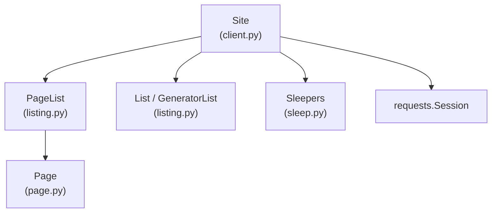
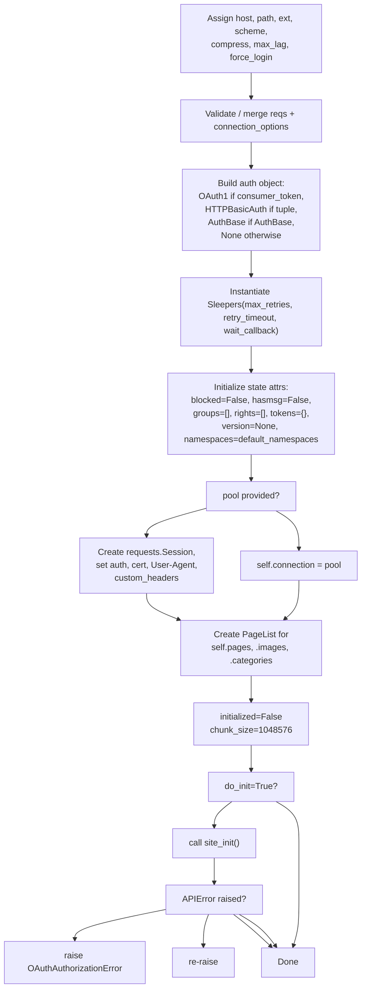
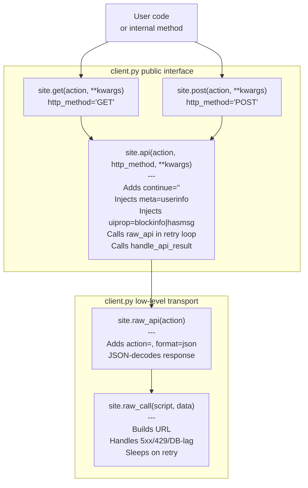

# The Site Class

> **Relevant source files**
> * [.gitignore](https://github.com/mwclient/mwclient/blob/47ea5b29/.gitignore)
> * [docs/source/index.rst](https://github.com/mwclient/mwclient/blob/47ea5b29/docs/source/index.rst)
> * [docs/source/user/connecting.rst](https://github.com/mwclient/mwclient/blob/47ea5b29/docs/source/user/connecting.rst)
> * [docs/source/user/page-ops.rst](https://github.com/mwclient/mwclient/blob/47ea5b29/docs/source/user/page-ops.rst)
> * [mwclient/__init__.py](https://github.com/mwclient/mwclient/blob/47ea5b29/mwclient/__init__.py)
> * [mwclient/client.py](https://github.com/mwclient/mwclient/blob/47ea5b29/mwclient/client.py)
> * [mwclient/sleep.py](https://github.com/mwclient/mwclient/blob/47ea5b29/mwclient/sleep.py)

This page is a reference for the `Site` class defined in [mwclient/client.py](https://github.com/mwclient/mwclient/blob/47ea5b29/mwclient/client.py)

: its constructor parameters, initialization sequence, key instance attributes, and the core public API methods (`get`, `post`, `api`). For connection and transport configuration details see [Connecting to a Site](/mwclient/mwclient/2.1-connecting-to-a-site). For authentication methods see [Authentication](/mwclient/mwclient/2.2-authentication). For the full internal API request pipeline see [API Request Pipeline](/mwclient/mwclient/2.3-api-request-pipeline). For retry and rate-limiting behavior see [Retry Mechanism and Rate Limiting](/mwclient/mwclient/2.4-retry-mechanism-and-rate-limiting).

---

## Overview

`Site` ([mwclient/client.py L25-L90](https://github.com/mwclient/mwclient/blob/47ea5b29/mwclient/client.py#L25-L90)

) is the central class in mwclient. Every operation — reading pages, making edits, uploading files, or querying lists — begins by constructing a `Site` instance. It:

* Manages the `requests.Session` used for all HTTP communication.
* Bootstraps site metadata (version, namespaces, user identity) via `site_init()`.
* Exposes `pages`, `images`, and `categories` as `PageList` entry points.
* Provides `get()`, `post()`, and `api()` as the core methods for calling `api.php`.
* Delegates retry logic to the `Sleepers`/`Sleeper` classes from `mwclient/sleep.py`.

The `Site` class is re-exported from `mwclient/__init__.py` ([mwclient/__init__.py L27](https://github.com/mwclient/mwclient/blob/47ea5b29/mwclient/__init__.py#L27-L27)

) as `mwclient.Site`.

**Relationship to other major classes:**



Sources: [mwclient/client.py L25-L220](https://github.com/mwclient/mwclient/blob/47ea5b29/mwclient/client.py#L25-L220)

 [mwclient/__init__.py L27](https://github.com/mwclient/mwclient/blob/47ea5b29/mwclient/__init__.py#L27-L27)

---

## Constructor

**Class:** `Site` in [mwclient/client.py L92-L218](https://github.com/mwclient/mwclient/blob/47ea5b29/mwclient/client.py#L92-L218)

```
Site(host, path, ext, pool, retry_timeout, max_retries, wait_callback,
     clients_useragent, max_lag, compress, force_login, do_init,
     httpauth, connection_options, consumer_token, consumer_secret,
     access_token, access_secret, client_certificate, custom_headers,
     scheme, reqs)
```

### Parameter Reference

| Parameter | Type | Default | Description |
| --- | --- | --- | --- |
| `host` | `str` | *(required)* | Hostname of the MediaWiki instance, without scheme (e.g. `en.wikipedia.org`) |
| `path` | `str` | `'/w/'` | Script path where `api.php` and `index.php` live; must end with `/` |
| `ext` | `str` | `'.php'` | File extension for API scripts |
| `pool` | `requests.Session` | `None` | Pre-existing session; when set, all auth/cert/header params are ignored |
| `retry_timeout` | `int` | `30` | Seconds to sleep per past retry; controls `Sleepers` |
| `max_retries` | `int` | `25` | Maximum retry attempts before `MaximumRetriesExceeded` is raised |
| `wait_callback` | `Callable` | no-op | Called on each retry attempt; receives `(Sleeper, retries, args)` |
| `clients_useragent` | `str` | `None` | Prepended to the default `mwclient/VERSION` user agent string |
| `max_lag` | `int` | `3` | `maxlag` value sent in `index.php` calls |
| `compress` | `bool` | `True` | Request gzip-compressed responses (`Accept-Encoding: gzip`) |
| `force_login` | `bool` | `True` | Require authentication before editing; set `False` to allow anonymous edits |
| `do_init` | `bool` | `True` | Run `site_init()` during construction; set `False` to defer |
| `httpauth` | `tuple` or `AuthBase` | `None` | HTTP Basic auth credentials or a `requests.auth.AuthBase` instance |
| `connection_options` | `dict` | `None` | Extra kwargs forwarded to `requests.Session.request()` on every call |
| `consumer_token` | `str` | `None` | OAuth1 consumer key |
| `consumer_secret` | `str` | `None` | OAuth1 consumer secret |
| `access_token` | `str` | `None` | OAuth1 access token |
| `access_secret` | `str` | `None` | OAuth1 access secret |
| `client_certificate` | `str` or `tuple` | `None` | Path to PEM file, or `(cert, key)` tuple for SSL client cert auth |
| `custom_headers` | `dict` | `None` | Additional headers added to every request |
| `scheme` | `str` | `'https'` | URI scheme (`'http'` or `'https'`) |
| `reqs` | `dict` | `None` | Deprecated alias for `connection_options`; raises `DeprecationWarning` |

Sources: [mwclient/client.py L92-L121](https://github.com/mwclient/mwclient/blob/47ea5b29/mwclient/client.py#L92-L121)

### Constructor Execution Order

**Diagram: `Site.__init__` execution flow**



Sources: [mwclient/client.py L122-L218](https://github.com/mwclient/mwclient/blob/47ea5b29/mwclient/client.py#L122-L218)

---

## The site_init() Method

`site_init()` ([mwclient/client.py L220-L255](https://github.com/mwclient/mwclient/blob/47ea5b29/mwclient/client.py#L220-L255)

) is the bootstrapping method that populates instance attributes from the live wiki. It is called automatically unless `do_init=False` is passed; it can also be called manually after `login()` to refresh user state.

### First call (not yet initialized)

Issues a single `query` API call with `meta='siteinfo|userinfo'`, `siprop='general|namespaces'`, `uiprop='groups|rights'`.

From the response it sets:

| Attribute | Source in API response |
| --- | --- |
| `self.site` | `query.general` |
| `self.namespaces` | `query.namespaces` (dict of `id → name`) |
| `self.version` | Parsed from `site['generator']` via `version_tuple_from_generator()` |
| `self.username` | `query.userinfo.name` |
| `self.groups` | `query.userinfo.groups` |
| `self.rights` | `query.userinfo.rights` |
| `self.initialized` | Set to `True` |

It also calls `self.require(1, 16)` to enforce a minimum MediaWiki version of 1.16.

### Subsequent calls (already initialized)

When `self.initialized` is already `True`, `site_init()` issues a lighter `query` for `meta='userinfo'` only, then refreshes `username`, `groups`, `rights`, and clears the `tokens` cache.

### Version Parsing

`version_tuple_from_generator()` ([mwclient/client.py L257-L320](https://github.com/mwclient/mwclient/blob/47ea5b29/mwclient/client.py#L257-L320)

) is a `@staticmethod` that converts the `generator` string (e.g. `"MediaWiki 1.39.5"`) into a tuple like `(1, 39, 5)`. The first two elements are always integers; later components may be strings (e.g. `(1, 39, "alpha")`). Raises `errors.MediaWikiVersionError` if the string is unrecognizable.

Sources: [mwclient/client.py L220-L320](https://github.com/mwclient/mwclient/blob/47ea5b29/mwclient/client.py#L220-L320)

---

## Key Instance Attributes

After a successful `site_init()`, the following attributes are reliably set:

| Attribute | Type | Description |
| --- | --- | --- |
| `host` | `str` | Hostname as passed to constructor |
| `path` | `str` | Script path (e.g. `/w/`) |
| `scheme` | `str` | `'https'` or `'http'` |
| `version` | `tuple` | MediaWiki version tuple, e.g. `(1, 39, 5)` |
| `namespaces` | `dict[int, str]` | Namespace ID → name mapping populated from the wiki |
| `site` | `dict` | Raw `query.general` siteinfo dict |
| `username` | `str` | Name of the currently authenticated user |
| `groups` | `list[str]` | Groups the current user belongs to |
| `rights` | `list[str]` | Rights the current user holds |
| `blocked` | `bool` or `tuple[str, str]` | `False` if not blocked; `(blocked_by, reason)` if blocked |
| `hasmsg` | `bool` | `True` if the current user has unread talk page messages |
| `logged_in` | `bool` | `True` if not anonymous |
| `tokens` | `dict[str, str]` | Cache of API tokens indexed by type (e.g. `'csrf'`) |
| `initialized` | `bool` | Set to `True` after first successful `site_init()` |
| `force_login` | `bool` | Controls whether unauthenticated edits are allowed |
| `pages` | `PageList` | Entry point for all wiki pages |
| `images` | `PageList` | Entry point scoped to namespace 6 (File) |
| `categories` | `PageList` | Entry point scoped to namespace 14 (Category) |
| `connection` | `requests.Session` | Underlying HTTP session |
| `sleepers` | `Sleepers` | Factory for per-operation `Sleeper` instances |
| `chunk_size` | `int` | Upload chunk size in bytes (default `1048576`) |

The `default_namespaces` class attribute ([mwclient/client.py L322-L328](https://github.com/mwclient/mwclient/blob/47ea5b29/mwclient/client.py#L322-L328)

) provides a fallback namespace mapping used before `site_init()` completes.

Sources: [mwclient/client.py L122-L255](https://github.com/mwclient/mwclient/blob/47ea5b29/mwclient/client.py#L122-L255)

 [mwclient/client.py L322-L328](https://github.com/mwclient/mwclient/blob/47ea5b29/mwclient/client.py#L322-L328)

---

## Core Public API Methods

These three methods form the standard interface for calling `api.php`. Higher-level methods on `Site`, `Page`, and `Image` all delegate to them.

**Diagram: Public API method call stack**



Sources: [mwclient/client.py L333-L496](https://github.com/mwclient/mwclient/blob/47ea5b29/mwclient/client.py#L333-L496)

### site.get(action, *args, **kwargs)

[mwclient/client.py L333-L350](https://github.com/mwclient/mwclient/blob/47ea5b29/mwclient/client.py#L333-L350)

Shorthand for `api(action, 'GET', ...)`. Use for idempotent read operations. Returns the parsed JSON response as a `dict`.

### site.post(action, *args, **kwargs)

[mwclient/client.py L352-L369](https://github.com/mwclient/mwclient/blob/47ea5b29/mwclient/client.py#L352-L369)

Shorthand for `api(action, 'POST', ...)`. Use for write operations. Returns the parsed JSON response as a `dict`.

### site.api(action, http_method='POST', *args, **kwargs)

[mwclient/client.py L371-L431](https://github.com/mwclient/mwclient/blob/47ea5b29/mwclient/client.py#L371-L431)

The primary API call method. Before dispatching:

1. For `action='query'` calls, automatically appends `|userinfo` to `meta` and `|blockinfo|hasmsg` to `uiprop` so that `blocked` and `hasmsg` are kept up to date on every query.
2. Sets `continue=''` on `query` calls to enable new-style continuation.
3. Creates a `Sleeper` for the call's retry loop.
4. Calls `raw_api()` in a `while True` loop, passing results to `handle_api_result()`.

Returns the raw response `dict` on success.

### handle_api_result(info, kwargs, sleeper)

[mwclient/client.py L433-L496](https://github.com/mwclient/mwclient/blob/47ea5b29/mwclient/client.py#L433-L496)

Called after each `raw_api()` response. It:

* Updates `self.blocked`, `self.hasmsg`, `self.logged_in` from `query.userinfo`.
* Logs any `warnings` in the response.
* On `internal_api_error_DBConnectionError` or `internal_api_error_DBQueryError`: calls `sleeper.sleep()` and returns `False` (triggers retry).
* On nonce-reuse OAuth error (`mwoauth-invalid-authorization` + `"Nonce already used"`): sleeps and retries.
* On any other `error`: raises `errors.APIError`.
* On success: returns `True`.

### raw_api(action, http_method, retry_on_error, *args, **kwargs)

[mwclient/client.py L623-L668](https://github.com/mwclient/mwclient/blob/47ea5b29/mwclient/client.py#L623-L668)

Adds `action=` and `format=json` to the parameter dict, calls `raw_call('api', data)`, and JSON-decodes the response. Raises `errors.APIDisabledError` if the API is disabled on the target site, or `errors.InvalidResponse` if the response is not valid JSON.

### raw_call(script, data, files, retry_on_error, http_method)

[mwclient/client.py L509-L621](https://github.com/mwclient/mwclient/blob/47ea5b29/mwclient/client.py#L509-L621)

The lowest HTTP layer. Constructs `{scheme}://{host}{path}{script}{ext}` and calls `self.connection.request()`. Handles:

* HTTP 200: returns `stream.text`.
* `x-database-lag` header: extracts wait time from `retry-after` and sleeps.
* HTTP 5xx or 429: sleeps and retries if `retry_on_error=True`.
* HTTP 4xx (other): calls `stream.raise_for_status()` immediately.
* `ConnectionError` / `Timeout`: retries if `retry_on_error=True`.
* Exhausted retries: raises the underlying exception or `MaximumRetriesExceeded`.

### raw_index(action, http_method, *args, **kwargs)

[mwclient/client.py L670-L703](https://github.com/mwclient/mwclient/blob/47ea5b29/mwclient/client.py#L670-L703)

Targets `index.php` rather than `api.php`. Automatically injects `maxlag=self.max_lag`. Returns raw text. Used for actions that must go through the web interface (e.g., some upload flows).

---

## require() — Version Gating

`require(major, minor, revision=None, raise_error=True)` ([mwclient/client.py L705-L761](https://github.com/mwclient/mwclient/blob/47ea5b29/mwclient/client.py#L705-L761)

) checks `self.version` against a required minimum. Called internally by `site_init()` to enforce MediaWiki >= 1.16. Returns `True` if satisfied, `False` (or raises `errors.MediaWikiVersionError`) if not.

---

## Class Attribute: api_limit

`Site.api_limit = 500` ([mwclient/client.py L90](https://github.com/mwclient/mwclient/blob/47ea5b29/mwclient/client.py#L90-L90)

) is the default maximum number of results that `api.php` returns per request. This value is referenced by listing classes when calculating chunk sizes. Privileged users (bots) typically have a limit of 5000; the listing infrastructure uses `handle_limit()` from `mwclient/util.py` to negotiate the appropriate value.

---

## Lifecycle Summary

```

```

Sources: [mwclient/client.py L203-L255](https://github.com/mwclient/mwclient/blob/47ea5b29/mwclient/client.py#L203-L255)

 [mwclient/client.py L803-L881](https://github.com/mwclient/mwclient/blob/47ea5b29/mwclient/client.py#L803-L881)