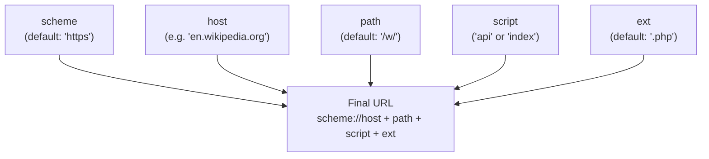
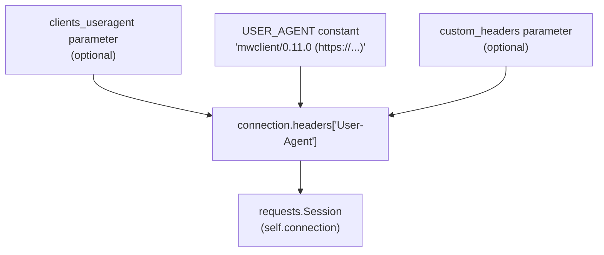
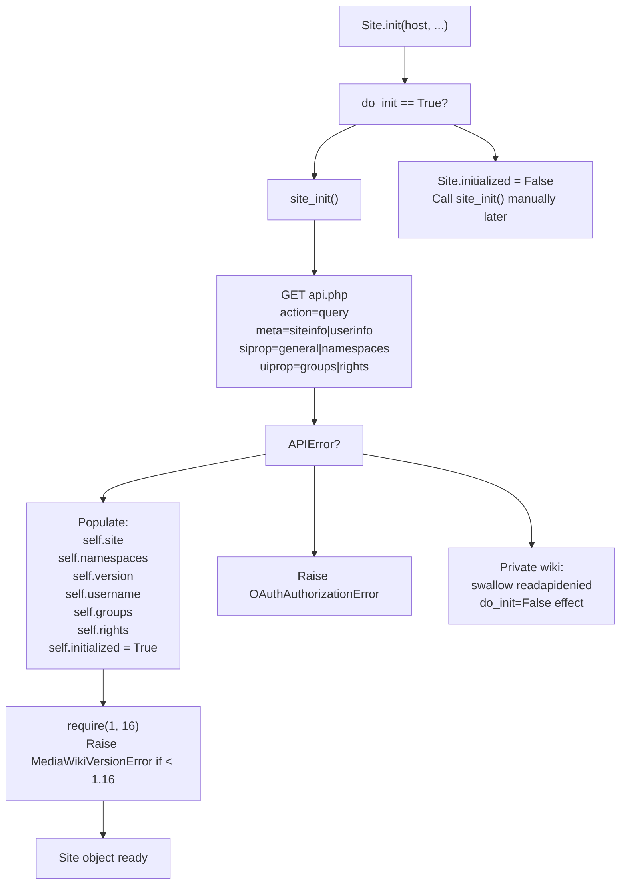
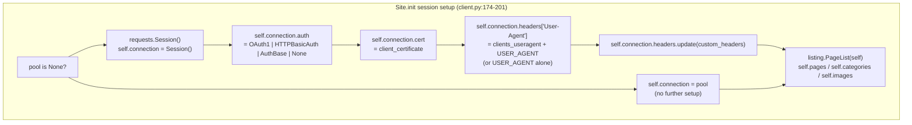

# Connecting to a Site

> **Relevant source files**
> * [docs/source/index.rst](https://github.com/mwclient/mwclient/blob/47ea5b29/docs/source/index.rst)
> * [docs/source/user/connecting.rst](https://github.com/mwclient/mwclient/blob/47ea5b29/docs/source/user/connecting.rst)
> * [docs/source/user/page-ops.rst](https://github.com/mwclient/mwclient/blob/47ea5b29/docs/source/user/page-ops.rst)
> * [mwclient/client.py](https://github.com/mwclient/mwclient/blob/47ea5b29/mwclient/client.py)
> * [test/integration.py](https://github.com/mwclient/mwclient/blob/47ea5b29/test/integration.py)
> * [test/resources/cat.jpg](https://github.com/mwclient/mwclient/blob/47ea5b29/test/resources/cat.jpg)
> * [test/test_client.py](https://github.com/mwclient/mwclient/blob/47ea5b29/test/test_client.py)

This page covers all configuration options available when constructing a `Site` object: how the API endpoint URL is built, the `scheme`, `path`, and `host` parameters, HTTP session options, SSL certificates, HTTP proxies, the User-Agent policy, and how to defer initialization with `do_init=False`.

Authentication methods (OAuth, `clientlogin`, `login`, `httpauth`) are covered in [Authentication](/mwclient/mwclient/2.2-authentication). The internal API request pipeline that runs after connection is established is covered in [API Request Pipeline](/mwclient/mwclient/2.3-api-request-pipeline).

---

## Overview

All interactions with a MediaWiki instance begin by constructing a `Site` object from `mwclient/client.py`. The constructor accepts the hostname of the target wiki, optional path and scheme overrides, and a collection of session-level options (headers, certificates, proxy settings). By default, the constructor immediately calls `site_init()` to fetch site metadata and populate instance attributes; this can be deferred.

**Minimal example:**

```javascript
import mwclientsite = mwclient.Site('en.wikipedia.org')
```

**With a custom user agent (recommended for Wikimedia wikis):**

```
site = mwclient.Site(    'en.wikipedia.org',    clients_useragent='MyCoolTool/0.2 (xyz@example.org)')
```

Sources: [mwclient/client.py L25-L89](https://github.com/mwclient/mwclient/blob/47ea5b29/mwclient/client.py#L25-L89)

 [docs/source/user/connecting.rst L1-L20](https://github.com/mwclient/mwclient/blob/47ea5b29/docs/source/user/connecting.rst#L1-L20)

---

## Constructor Parameters

The table below lists every parameter of `Site.__init__` that affects connection behavior. Authentication-specific parameters are listed briefly here but described fully in [Authentication](/mwclient/mwclient/2.2-authentication).

| Parameter | Type | Default | Purpose |
| --- | --- | --- | --- |
| `host` | `str` | *(required)* | Hostname without scheme, e.g. `en.wikipedia.org` |
| `path` | `str` | `'/w/'` | Script path where `api.php` and `index.php` live |
| `scheme` | `str` | `'https'` | URI scheme: `'https'` or `'http'` |
| `ext` | `str` | `'.php'` | File extension appended to script names |
| `clients_useragent` | `str \| None` | `None` | Prefix prepended to mwclient's own User-Agent string |
| `custom_headers` | `Mapping[str, str] \| None` | `None` | Arbitrary HTTP headers added to every request |
| `connection_options` | `MutableMapping[str, Any] \| None` | `None` | Extra kwargs forwarded to `requests.Session.request` |
| `reqs` | *(deprecated)* | `None` | Alias for `connection_options`; raises `DeprecationWarning` |
| `httpauth` | `tuple \| AuthBase \| None` | `None` | HTTP Basic Auth or custom `requests.auth.AuthBase` |
| `client_certificate` | `str \| tuple[str, str] \| None` | `None` | Path to PEM file, or `(cert, key)` tuple for SSL client auth |
| `pool` | `requests.Session \| None` | `None` | Supply a pre-built session; bypasses all session setup |
| `max_lag` | `int` | `3` | `maxlag` parameter used in `index.php` calls |
| `compress` | `bool` | `True` | Request gzip-compressed responses |
| `force_login` | `bool` | `True` | Raise error on edit attempts when not authenticated |
| `do_init` | `bool` | `True` | Call `site_init()` automatically on construction |
| `retry_timeout` | `int` | `30` | Seconds to wait per retry attempt |
| `max_retries` | `int` | `25` | Maximum number of retries before raising `MaximumRetriesExceeded` |
| `wait_callback` | `Callable` | `lambda *x: None` | Called on each retry |
| `consumer_token` | `str \| None` | `None` | OAuth 1 consumer key |
| `consumer_secret` | `str \| None` | `None` | OAuth 1 consumer secret |
| `access_token` | `str \| None` | `None` | OAuth 1 access key |
| `access_secret` | `str \| None` | `None` | OAuth 1 access secret |

Sources: [mwclient/client.py L92-L121](https://github.com/mwclient/mwclient/blob/47ea5b29/mwclient/client.py#L92-L121)

---

## URL Construction

Every API call targets a URL assembled from `scheme`, `host`, `path`, the script name (`api` or `index`), and `ext`. The assembly happens inside `raw_call` in `mwclient/client.py`.

**URL construction diagram:**



For example, the default configuration produces:

* `https://en.wikipedia.org/w/api.php` for `raw_api` calls
* `https://en.wikipedia.org/w/index.php` for `raw_index` calls

Sources: [mwclient/client.py L552-L562](https://github.com/mwclient/mwclient/blob/47ea5b29/mwclient/client.py#L552-L562)

---

## Script Path (path)

MediaWiki's `$wgScriptPath` setting determines where `api.php` is located on the server. The mwclient default `/w/` matches the Wikimedia wiki convention. If a wiki uses a different path, connection will fail with a 404 or an `InvalidResponse` error.

Common configurations:

| Wiki type | `path` value |
| --- | --- |
| Wikimedia wikis (Wikipedia, etc.) | `/w/` *(default)* |
| Wikia/Fandom wikis | `/` |
| Self-hosted wikis | Varies; check `$wgScriptPath` |

```markdown
# Wikia / Fandom wiki at the rootsite = mwclient.Site('vim.fandom.com', path='/') # Wiki with a custom installation pathsite = mwclient.Site('my-wiki.org', path='/mediawiki/')
```

Sources: [mwclient/client.py L94-L95](https://github.com/mwclient/mwclient/blob/47ea5b29/mwclient/client.py#L94-L95)

 [docs/source/user/connecting.rst L31-L43](https://github.com/mwclient/mwclient/blob/47ea5b29/docs/source/user/connecting.rst#L31-L43)

---

## Scheme

The `scheme` parameter selects between `'https'` (the default) and `'http'`. HTTPS is strongly recommended and is the default.

```markdown
# Force HTTPsite = mwclient.Site('internal.corp.example', scheme='http')
```

The `scheme` is stored as `self.scheme` and used directly in `raw_call` to build the request URL.

> **Deprecated behavior:** In versions before 0.10.1, `host` could be passed as a `(scheme, host)` tuple. Passing a tuple now emits a `DeprecationWarning` and is handled in `raw_call` for backward compatibility. Use the `scheme` argument instead.

Sources: [mwclient/client.py L119](https://github.com/mwclient/mwclient/blob/47ea5b29/mwclient/client.py#L119-L119)

 [mwclient/client.py L552-L560](https://github.com/mwclient/mwclient/blob/47ea5b29/mwclient/client.py#L552-L560)

 [test/test_client.py L141-L148](https://github.com/mwclient/mwclient/blob/47ea5b29/test/test_client.py#L141-L148)

 [test/test_client.py L179-L186](https://github.com/mwclient/mwclient/blob/47ea5b29/test/test_client.py#L179-L186)

---

## User-Agent Policy

mwclient sends a default `User-Agent` header identifying the library version:

```
mwclient/0.11.0 (https://github.com/mwclient/mwclient)
```

The constant `USER_AGENT` is defined at module level in `mwclient/client.py`.

### clients_useragent — Prepending a Tool Name

Wikimedia wikis require a meaningful User-Agent identifying your tool. Use `clients_useragent` to prepend your tool's identity. The recommended format is:

```
{tool_name}/{tool_version} ({contact_info})
```

The final header value is:

```
{clients_useragent} mwclient/0.11.0 (https://github.com/mwclient/mwclient)
```

```javascript
site = mwclient.Site(    'en.wikipedia.org',    clients_useragent='MyCoolTool/0.2 (xyz@example.org)')# site.connection.headers['User-Agent']# => 'MyCoolTool/0.2 (xyz@example.org) mwclient/0.11.0 (...)'
```

### custom_headers — Full Control

To override the User-Agent entirely or add any other headers, use `custom_headers`. These are applied via `self.connection.headers.update(custom_headers)`, so they take effect for the lifetime of the session.

```
site = mwclient.Site(    'en.wikipedia.org',    custom_headers={'User-Agent': 'MyTool/1.0', 'X-Wikimedia-Debug': 'host=mw1099.eqiad.wmnet'})
```

**User-Agent construction diagram:**



Sources: [mwclient/client.py L22](https://github.com/mwclient/mwclient/blob/47ea5b29/mwclient/client.py#L22-L22)

 [mwclient/client.py L181-L189](https://github.com/mwclient/mwclient/blob/47ea5b29/mwclient/client.py#L181-L189)

 [docs/source/user/connecting.rst L46-L72](https://github.com/mwclient/mwclient/blob/47ea5b29/docs/source/user/connecting.rst#L46-L72)

 [test/test_client.py L189-L206](https://github.com/mwclient/mwclient/blob/47ea5b29/test/test_client.py#L189-L206)

---

## HTTP Session Options

### connection_options

A dictionary of keyword arguments forwarded verbatim to every call to `requests.Session.request`. This is stored as `self.requests` and applied in `raw_call`.

If the `timeout` key is absent, a default of **30 seconds** is added automatically.

```
site = mwclient.Site(    'en.wikipedia.org',    connection_options={'timeout': 60, 'stream': False})
```

> **`reqs` (deprecated):** The `reqs` parameter is a deprecated alias for `connection_options`, present for compatibility. Specifying both raises a `ValueError`. Using `reqs` alone emits a `DeprecationWarning`.

### HTTP Proxies

Proxies are configured via `connection_options` using the `proxies` key, which is passed directly to `requests`:

```
proxies = {    'http': 'http://10.10.1.10:3128',    'https': 'http://10.10.1.10:1080',}site = mwclient.Site('en.wikipedia.org', connection_options={'proxies': proxies})
```

Sources: [mwclient/client.py L112](https://github.com/mwclient/mwclient/blob/47ea5b29/mwclient/client.py#L112-L112)

 [mwclient/client.py L131-L144](https://github.com/mwclient/mwclient/blob/47ea5b29/mwclient/client.py#L131-L144)

 [mwclient/client.py L566-L573](https://github.com/mwclient/mwclient/blob/47ea5b29/mwclient/client.py#L566-L573)

 [test/test_client.py L518-L527](https://github.com/mwclient/mwclient/blob/47ea5b29/test/test_client.py#L518-L527)

 [docs/source/user/connecting.rst L79-L91](https://github.com/mwclient/mwclient/blob/47ea5b29/docs/source/user/connecting.rst#L79-L91)

---

## SSL Client Certificates

The `client_certificate` parameter maps directly to the `cert` attribute of `requests.Session`. Two forms are accepted:

| Form | Example |
| --- | --- |
| Single PEM file (cert + key combined) | `'/path/to/client-and-key.pem'` |
| Tuple of `(certificate_file, key_file)` | `('client.pem', 'key.pem')` |

```markdown
# Single filesite = mwclient.Site('secure.wiki.org', client_certificate='/path/to/cert.pem') # Separate cert and key filessite = mwclient.Site('secure.wiki.org', client_certificate=('client.pem', 'key.pem'))
```

> The private key must not be encrypted (no passphrase).

This is set at `self.connection.cert` during session setup.

Sources: [mwclient/client.py L117](https://github.com/mwclient/mwclient/blob/47ea5b29/mwclient/client.py#L117-L117)

 [mwclient/client.py L178-L179](https://github.com/mwclient/mwclient/blob/47ea5b29/mwclient/client.py#L178-L179)

 [docs/source/user/connecting.rst L209-L225](https://github.com/mwclient/mwclient/blob/47ea5b29/docs/source/user/connecting.rst#L209-L225)

---

## Using a Pre-built Session (pool)

If you need to fully control the `requests.Session` (e.g., to integrate with a custom authentication system or share a session across multiple `Site` objects), pass it as the `pool` parameter. When `pool` is provided, mwclient skips all session setup: `client_certificate`, `clients_useragent`, `custom_headers`, `httpauth`, and all OAuth parameters are ignored.

```javascript
import requestsimport mwclient session = requests.Session()session.headers['User-Agent'] = 'MyCustomAgent/1.0'# ... any other custom session configuration site = mwclient.Site('en.wikipedia.org', pool=session)
```

Sources: [mwclient/client.py L97](https://github.com/mwclient/mwclient/blob/47ea5b29/mwclient/client.py#L97-L97)

 [mwclient/client.py L175-L191](https://github.com/mwclient/mwclient/blob/47ea5b29/mwclient/client.py#L175-L191)

---

## Initialization Sequence and do_init

### Normal Initialization

By default (`do_init=True`), the constructor calls `site_init()` immediately after setting up the session. `site_init()` makes a single GET request to `api.php?action=query&meta=siteinfo|userinfo&siprop=general|namespaces&uiprop=groups|rights` and populates the following instance attributes:

| Attribute | Source |
| --- | --- |
| `self.site` | `query.general` |
| `self.namespaces` | `query.namespaces` |
| `self.version` | Parsed from `general.generator` |
| `self.username` | `query.userinfo.name` |
| `self.groups` | `query.userinfo.groups` |
| `self.rights` | `query.userinfo.rights` |
| `self.initialized` | Set to `True` |

After `site_init()`, mwclient asserts that the wiki is at least MediaWiki 1.16 via `self.require(1, 16)`.

### site_init() flow diagram



Sources: [mwclient/client.py L104-L106](https://github.com/mwclient/mwclient/blob/47ea5b29/mwclient/client.py#L104-L106)

 [mwclient/client.py L209-L218](https://github.com/mwclient/mwclient/blob/47ea5b29/mwclient/client.py#L209-L218)

 [mwclient/client.py L220-L255](https://github.com/mwclient/mwclient/blob/47ea5b29/mwclient/client.py#L220-L255)

### do_init=False — Deferred Initialization

Set `do_init=False` when the wiki is private (read-protected) and you need to authenticate before the API can respond. In this case, `self.initialized` remains `False` and `self.version` is `None` until you manually call `site_init()`.

```markdown
site = mwclient.Site('private.wiki.org', do_init=False)site.login('myuser', 'mypassword')  # or site.clientlogin(...)# site_init() is called automatically inside login()
```

> **Private wikis:** When `do_init=True` and the server returns `readapidenied` or `unknown_action`, the error is silently swallowed and `site.initialized` is left as `False`. This allows the object to be constructed so that `login()` can be called next. Any other `APIError` is re-raised.

Sources: [mwclient/client.py L104-L106](https://github.com/mwclient/mwclient/blob/47ea5b29/mwclient/client.py#L104-L106)

 [mwclient/client.py L209-L218](https://github.com/mwclient/mwclient/blob/47ea5b29/mwclient/client.py#L209-L218)

 [test/test_client.py L285-L298](https://github.com/mwclient/mwclient/blob/47ea5b29/test/test_client.py#L285-L298)

---

## Connection Setup Internals

The diagram below maps constructor parameters to the code entities they affect during session setup.



Sources: [mwclient/client.py L174-L201](https://github.com/mwclient/mwclient/blob/47ea5b29/mwclient/client.py#L174-L201)

---

## Error Conditions at Connection Time

| Condition | Exception raised |
| --- | --- |
| Wiki requires OAuth and credentials are invalid | `errors.OAuthAuthorizationError` |
| Server returns a 4xx response | `requests.exceptions.HTTPError` |
| MediaWiki version < 1.16 | `errors.MediaWikiVersionError` |
| API disabled on server | `errors.APIDisabledError` |
| Invalid `httpauth` type (not tuple or `AuthBase`) | `RuntimeError` |
| Both `reqs` and `connection_options` specified | `ValueError` |
| Network failure during `site_init` | `requests.exceptions.ConnectionError` |

Sources: [mwclient/client.py L82-L89](https://github.com/mwclient/mwclient/blob/47ea5b29/mwclient/client.py#L82-L89)

 [mwclient/client.py L209-L218](https://github.com/mwclient/mwclient/blob/47ea5b29/mwclient/client.py#L209-L218)

 [mwclient/client.py L246-L248](https://github.com/mwclient/mwclient/blob/47ea5b29/mwclient/client.py#L246-L248)

 [mwclient/client.py L159-L160](https://github.com/mwclient/mwclient/blob/47ea5b29/mwclient/client.py#L159-L160)

 [mwclient/client.py L131-L134](https://github.com/mwclient/mwclient/blob/47ea5b29/mwclient/client.py#L131-L134)

 [test/test_client.py L169-L176](https://github.com/mwclient/mwclient/blob/47ea5b29/test/test_client.py#L169-L176)