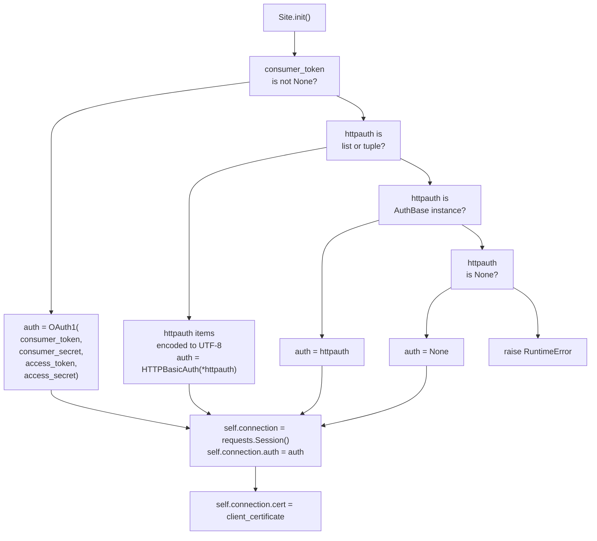
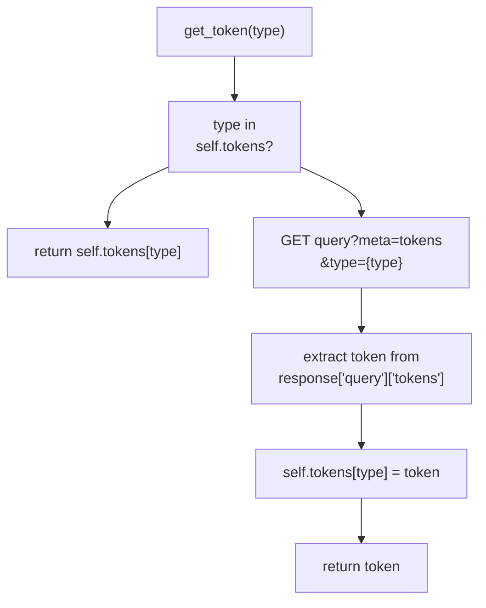
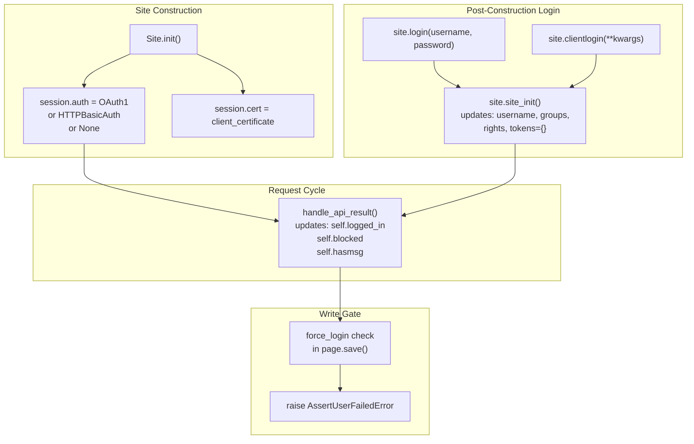

# Authentication

> **Relevant source files**
> * [docs/source/index.rst](https://github.com/mwclient/mwclient/blob/47ea5b29/docs/source/index.rst)
> * [docs/source/user/connecting.rst](https://github.com/mwclient/mwclient/blob/47ea5b29/docs/source/user/connecting.rst)
> * [docs/source/user/page-ops.rst](https://github.com/mwclient/mwclient/blob/47ea5b29/docs/source/user/page-ops.rst)
> * [mwclient/client.py](https://github.com/mwclient/mwclient/blob/47ea5b29/mwclient/client.py)
> * [mwclient/errors.py](https://github.com/mwclient/mwclient/blob/47ea5b29/mwclient/errors.py)
> * [test/integration.py](https://github.com/mwclient/mwclient/blob/47ea5b29/test/integration.py)
> * [test/resources/cat.jpg](https://github.com/mwclient/mwclient/blob/47ea5b29/test/resources/cat.jpg)
> * [test/test_client.py](https://github.com/mwclient/mwclient/blob/47ea5b29/test/test_client.py)

This page documents every authentication mechanism supported by mwclient, how each is configured on the `Site` object, how login tokens are acquired and cached, and which errors are raised on failure. For how the `Site` object is constructed and connected, see page [2.1](/mwclient/mwclient/2.1-connecting-to-a-site). For how API calls travel through the request pipeline after authentication is established, see page [2.3](/mwclient/mwclient/2.3-api-request-pipeline).

---

## Overview

mwclient supports five distinct authentication strategies. They are configured at construction time or via explicit method calls after the `Site` object is created. The table below summarises each method.

| Strategy | Constructor params | Method call | `requests.Session.auth` type |
| --- | --- | --- | --- |
| OAuth 1 | `consumer_token`, `consumer_secret`, `access_token`, `access_secret` | None | `OAuth1` |
| HTTP Basic | `httpauth=(user, password)` | None | `HTTPBasicAuth` |
| HTTP Custom Auth | `httpauth=<AuthBase instance>` | None | custom `AuthBase` |
| SSL Client Cert | `client_certificate=...` | None | N/A (cert on session) |
| MW `clientlogin` | — | `site.clientlogin(...)` | None |
| MW legacy `login` | — | `site.login(...)` | None |

**Authentication method selection — `Site.__init__`:**



Sources: [mwclient/client.py L146-L191](https://github.com/mwclient/mwclient/blob/47ea5b29/mwclient/client.py#L146-L191)

---

## OAuth 1

mwclient supports OAuth 1 only (not OAuth 2). Authentication is done via `requests_oauthlib.OAuth1`, which is attached to the `requests.Session` and signs every outgoing request automatically. No separate login call is needed.

Pass all four credentials to the `Site` constructor:

```
site = mwclient.Site(    'en.wikipedia.org',    consumer_token='my_consumer_token',    consumer_secret='my_consumer_secret',    access_token='my_access_token',    access_secret='my_access_secret')
```

If the credentials are invalid, `site_init()` will receive an `APIError` with code `mwoauth-invalid-authorization` from the server. `Site.__init__` catches this and re-raises it as `errors.OAuthAuthorizationError` [mwclient/client.py L212-L214](https://github.com/mwclient/mwclient/blob/47ea5b29/mwclient/client.py#L212-L214)

```python
# mwclient/errors.pyclass OAuthAuthorizationError(LoginError):    pass
```

When a `pool` (pre-existing `requests.Session`) is provided to `Site`, all four OAuth parameters and `httpauth` are ignored, because the session is used as-is [mwclient/client.py L174-L191](https://github.com/mwclient/mwclient/blob/47ea5b29/mwclient/client.py#L174-L191)

Sources: [mwclient/client.py L146-L148](https://github.com/mwclient/mwclient/blob/47ea5b29/mwclient/client.py#L146-L148)

 [mwclient/client.py L209-L218](https://github.com/mwclient/mwclient/blob/47ea5b29/mwclient/client.py#L209-L218)

 [mwclient/errors.py L128-L137](https://github.com/mwclient/mwclient/blob/47ea5b29/mwclient/errors.py#L128-L137)

 [test/test_client.py L247-L254](https://github.com/mwclient/mwclient/blob/47ea5b29/test/test_client.py#L247-L254)

---

## HTTP Basic Authentication

Pass a `(username, password)` tuple to the `httpauth` parameter. mwclient wraps it in `requests.auth.HTTPBasicAuth`. String values are explicitly encoded to UTF-8 before being passed to `HTTPBasicAuth` to work around a `requests` default that encodes credentials as latin-1 [mwclient/client.py L148-L155](https://github.com/mwclient/mwclient/blob/47ea5b29/mwclient/client.py#L148-L155)

```
site = mwclient.Site('mywiki.example.org', httpauth=('myuser', 'mypassword'))
```

To use any other auth scheme from `requests`, pass an instance of `requests.auth.AuthBase` directly:

```javascript
from requests.auth import HTTPDigestAuthsite = mwclient.Site('mywiki.example.org', httpauth=HTTPDigestAuth('u', 'p'))
```

Passing any other type raises a `RuntimeError` [mwclient/client.py L158-L160](https://github.com/mwclient/mwclient/blob/47ea5b29/mwclient/client.py#L158-L160)

> **Note:** HTTP authentication controls access to the API endpoint at the web-server level. It is independent of MediaWiki's own user authentication. You may need both HTTP auth (for server access) and a MW login (for editing rights).

Sources: [mwclient/client.py L148-L160](https://github.com/mwclient/mwclient/blob/47ea5b29/mwclient/client.py#L148-L160)

 [test/test_client.py L220-L244](https://github.com/mwclient/mwclient/blob/47ea5b29/test/test_client.py#L220-L244)

---

## SSL Client Certificate Authentication

Pass a path to a PEM file, or a `(certificate, key)` tuple, via the `client_certificate` parameter. This is forwarded to `requests.Session.cert` [mwclient/client.py L178-L179](https://github.com/mwclient/mwclient/blob/47ea5b29/mwclient/client.py#L178-L179)

:

```markdown
# Single combined PEMsite = mwclient.Site('mywiki.example.org', client_certificate='/path/to/client.pem') # Separate certificate and key filessite = mwclient.Site('mywiki.example.org', client_certificate=('client.pem', 'key.pem'))
```

The private key must not be encrypted.

Sources: [mwclient/client.py L117](https://github.com/mwclient/mwclient/blob/47ea5b29/mwclient/client.py#L117-L117)

 [mwclient/client.py L178-L179](https://github.com/mwclient/mwclient/blob/47ea5b29/mwclient/client.py#L178-L179)

 [docs/source/user/connecting.rst L209-L225](https://github.com/mwclient/mwclient/blob/47ea5b29/docs/source/user/connecting.rst#L209-L225)

---

## clientlogin — Recommended MW Login

`site.clientlogin()` uses the MediaWiki `clientlogin` API action, which is the method currently recommended by MediaWiki for interactive authentication without OAuth.

**Flow diagram:**

```mermaid
sequenceDiagram
  participant User Code
  participant site.clientlogin()
  participant GT
  participant RA
  participant MediaWiki API

  User Code->>site.clientlogin(): "clientlogin(username=..., password=...)"
  site.clientlogin()->>MediaWiki API: "get login token"
  MediaWiki API->>MediaWiki API: "GET query?meta=tokens&type=login"
  MediaWiki API-->>MediaWiki API: "{'logintoken': 'abc+\\'}"
  MediaWiki API-->>site.clientlogin(): "token string"
  site.clientlogin()->>MediaWiki API: "POST clientlogin (with logintoken, loginreturnurl)"
  MediaWiki API->>MediaWiki API: "POST action=clientlogin"
  MediaWiki API-->>MediaWiki API: "{'clientlogin': {'status': '...'}}"
  MediaWiki API-->>site.clientlogin(): "response dict"
  loop ["status == PASS"]
    site.clientlogin()-->>User Code: "True (calls site_init())"
    site.clientlogin()-->>User Code: "raise LoginError"
    site.clientlogin()-->>User Code: "response dict (multi-step)"
  end
```

`clientlogin` automatically injects `logintoken` (fetched via `get_token('login')`) and adds `loginreturnurl` if neither `loginreturnurl` nor `logincontinue` is already in `kwargs`.

**Simple usage:**

```
site.clientlogin(username='myuser', password='secret')
```

**Multi-step login** (e.g., for two-factor auth extensions): if the server returns a status other than `PASS` or `FAIL` (e.g., `UI`, `REDIRECT`), `clientlogin` returns the raw response dict. The caller is expected to process it and call `clientlogin` again with updated arguments, including `logincontinue=1` instead of `loginreturnurl`.

After a successful `PASS`, `site_init()` is called to refresh `username`, `groups`, `rights`, and `tokens`.

Sources: [mwclient/client.py L883-L960](https://github.com/mwclient/mwclient/blob/47ea5b29/mwclient/client.py#L883-L960)

 [test/test_client.py L591-L702](https://github.com/mwclient/mwclient/blob/47ea5b29/test/test_client.py#L591-L702)

 [docs/source/user/connecting.rst L141-L167](https://github.com/mwclient/mwclient/blob/47ea5b29/docs/source/user/connecting.rst#L141-L167)

---

## Legacy login() — Bot Passwords

`site.login()` uses the older `action=login` API. From MediaWiki 1.27 onwards, logging in with an account's main password via this method is deprecated. It remains the correct method for **bot passwords**.

**Flow diagram:**

```mermaid
sequenceDiagram
  participant User Code
  participant site.login()
  participant GT
  participant RA
  participant site.site_init()
  participant MediaWiki API

  User Code->>site.login(): "login(username, password, domain?)"
  note over site.login(): "stores credentials in self.credentials"
  site.login()->>MediaWiki API: "attempt get_token('login') [MW 1.27+]"
  MediaWiki API->>MediaWiki API: "GET query?meta=tokens&type=login"
  MediaWiki API-->>MediaWiki API: "logintoken or APIError"
  loop ["result == Success"]
    site.login()->>MediaWiki API: "POST action=login (lgname, lgpassword, lgtoken?)"
    MediaWiki API->>MediaWiki API: "POST"
    MediaWiki API-->>MediaWiki API: "{'login': {'result': '...'}}"
    MediaWiki API-->>site.login(): "break"
    note over site.login(): "set lgtoken from response"
    note over site.login(): "sleeper.sleep(wait)"
    site.login()-->>User Code: "raise LoginError"
  end
  site.login()->>site.site_init(): "site_init()"
  site.site_init()-->>site.login(): "updates username, groups, rights, tokens"
  site.login()-->>User Code: "None (success)"
```

**Two login token paths:**

| MW version | Token acquisition |
| --- | --- |
| ≥ 1.27 | `get_token('login')` → `GET query?meta=tokens&type=login` |
| < 1.27 | First `POST login` returns `NeedToken` result with the token inline |

If `get_token('login')` raises `APIError` or `KeyError`, the code falls back to the older path [mwclient/client.py L863-L866](https://github.com/mwclient/mwclient/blob/47ea5b29/mwclient/client.py#L863-L866)

`self.credentials` is set to `(username, password, domain)` [mwclient/client.py L847](https://github.com/mwclient/mwclient/blob/47ea5b29/mwclient/client.py#L847-L847)

 so that the login call can be repeated if needed (e.g., after a session expires).

Sources: [mwclient/client.py L803-L881](https://github.com/mwclient/mwclient/blob/47ea5b29/mwclient/client.py#L803-L881)

 [test/test_client.py L529-L588](https://github.com/mwclient/mwclient/blob/47ea5b29/test/test_client.py#L529-L588)

 [test/integration.py L125-L163](https://github.com/mwclient/mwclient/blob/47ea5b29/test/integration.py#L125-L163)

---

## Token Acquisition and Caching — get_token()

`get_token(type)` is called internally by `login()`, `clientlogin()`, and page-editing methods to retrieve CSRF and login tokens. It caches tokens in `self.tokens` (a `dict` initialised at [mwclient/client.py L169](https://github.com/mwclient/mwclient/blob/47ea5b29/mwclient/client.py#L169-L169)

).



`self.tokens` is cleared when `site_init()` is called (i.e., after every successful login) [mwclient/client.py L231](https://github.com/mwclient/mwclient/blob/47ea5b29/mwclient/client.py#L231-L231)

 forcing fresh token acquisition.

The token type strings used internally:

| Token type | Used by |
| --- | --- |
| `'login'` | `login()`, `clientlogin()` |
| `'csrf'` | `page.edit()`, `page.move()`, `page.delete()`, `upload()` |
| `'email'` | `site.email()` |

Sources: [mwclient/client.py L169](https://github.com/mwclient/mwclient/blob/47ea5b29/mwclient/client.py#L169-L169)

 [mwclient/client.py L231](https://github.com/mwclient/mwclient/blob/47ea5b29/mwclient/client.py#L231-L231)

 [mwclient/client.py L791](https://github.com/mwclient/mwclient/blob/47ea5b29/mwclient/client.py#L791-L791)

 [mwclient/client.py L863-L865](https://github.com/mwclient/mwclient/blob/47ea5b29/mwclient/client.py#L863-L865)

---

## force_login and AssertUserFailedError

`Site` has a `force_login` attribute (default `True`) [mwclient/client.py L104](https://github.com/mwclient/mwclient/blob/47ea5b29/mwclient/client.py#L104-L104)

 that controls whether write operations are gated on authentication. When `force_login=True` and the user is not logged in, attempting to edit a page raises `errors.AssertUserFailedError` before any API call is made.

To allow unauthenticated edits, set:

```
site.force_login = False
```

or pass `force_login=False` at construction time.

`self.logged_in` is a boolean updated by `handle_api_result()` on every API response. It reflects the MediaWiki server's view of the session: it is `True` when `'anon'` is absent from the `userinfo` block returned by the server [mwclient/client.py L464-L465](https://github.com/mwclient/mwclient/blob/47ea5b29/mwclient/client.py#L464-L465)

Sources: [mwclient/client.py L104](https://github.com/mwclient/mwclient/blob/47ea5b29/mwclient/client.py#L104-L104)

 [mwclient/client.py L129-L130](https://github.com/mwclient/mwclient/blob/47ea5b29/mwclient/client.py#L129-L130)

 [mwclient/client.py L464-L465](https://github.com/mwclient/mwclient/blob/47ea5b29/mwclient/client.py#L464-L465)

 [mwclient/errors.py L140-L150](https://github.com/mwclient/mwclient/blob/47ea5b29/mwclient/errors.py#L140-L150)

---

## Login State and Authentication — How They Interact



Sources: [mwclient/client.py L146-L214](https://github.com/mwclient/mwclient/blob/47ea5b29/mwclient/client.py#L146-L214)

 [mwclient/client.py L456-L465](https://github.com/mwclient/mwclient/blob/47ea5b29/mwclient/client.py#L456-L465)

 [mwclient/errors.py L140-L150](https://github.com/mwclient/mwclient/blob/47ea5b29/mwclient/errors.py#L140-L150)

---

## Error Reference

| Exception | Location | Trigger |
| --- | --- | --- |
| `errors.LoginError` | `mwclient/errors.py:103` | `login()` receives a non-Success, non-NeedToken, non-Throttled result; `clientlogin()` receives `FAIL` status |
| `errors.OAuthAuthorizationError` | `mwclient/errors.py:128` | `site_init()` receives `mwoauth-invalid-authorization` API error during construction |
| `errors.AssertUserFailedError` | `mwclient/errors.py:140` | Write operation attempted when `logged_in=False` and `force_login=True` |
| `RuntimeError` | `mwclient/client.py:160` | `httpauth` is neither a tuple/list nor an `AuthBase` instance |

`LoginError` carries `.code` (the API result string, e.g. `"Failed"`) and `.info` (human-readable reason). `OAuthAuthorizationError` inherits the same attributes from `LoginError`.

Sources: [mwclient/errors.py L103-L150](https://github.com/mwclient/mwclient/blob/47ea5b29/mwclient/errors.py#L103-L150)

 [mwclient/client.py L158-L160](https://github.com/mwclient/mwclient/blob/47ea5b29/mwclient/client.py#L158-L160)

 [mwclient/client.py L875-L879](https://github.com/mwclient/mwclient/blob/47ea5b29/mwclient/client.py#L875-L879)

---

## Private Wikis

A private wiki returns `readapidenied` or `unknown_action` from the initial `site_init()` query. `Site.__init__` catches these specific error codes and suppresses the exception, leaving `self.initialized = False` [mwclient/client.py L216-L218](https://github.com/mwclient/mwclient/blob/47ea5b29/mwclient/client.py#L216-L218)

 The caller must then call `site.login()` or `site.clientlogin()` before making any API queries. A successful login calls `site_init()` internally, completing initialisation.

Sources: [mwclient/client.py L209-L218](https://github.com/mwclient/mwclient/blob/47ea5b29/mwclient/client.py#L209-L218)

 [mwclient/client.py L220-L255](https://github.com/mwclient/mwclient/blob/47ea5b29/mwclient/client.py#L220-L255)

 [test/test_client.py L285-L298](https://github.com/mwclient/mwclient/blob/47ea5b29/test/test_client.py#L285-L298)